# 书生·浦语大模型全链路开源体系（学习笔记）

## 1、背景：专用模型到通用大模型
1. 专用模型：针对特定任务，一个模型解决一个问题
2. 通用大模型：一个模型对应多个任务、多种模态

## 2、书生·浦语大模型
### 2.1 开源历程
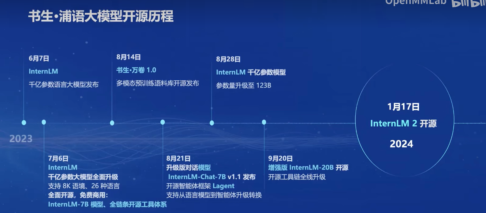

### 2.2 InternLM2 体系
不同参数量的模型应用于不同场景：
- 7B: 轻量级应用
- 20B:支持更加复杂的使用场景
 
每个参数量级的模型包含3种架构：
- **InternLM2-Base**: 高质量基座模型
- **InternLM**: 在通用语言能力基础上，强化了多个方向的能力
- **InternLM2-Chat**: 再Base基础上，经过了SFT和RLHF，面向对话交互进行了优化，具有很好的指令遵循、共情聊天和调用工具等能力。

### 2.3 InternLM2的改进点
**根本： 回归语言建模的本质**
- 多维度数据价值评估
- 高质量语料驱动的数据富集
- 有针对性的数据补齐
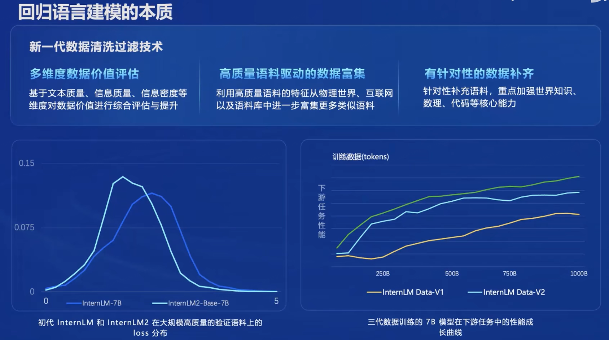

### 2.4 InternLM2 主要亮点
- 超长上下文
- 综合性能全面提升
- 优秀的对话和创作体验
- 工具调用能力
- 内生的数理能力和数据分析工具
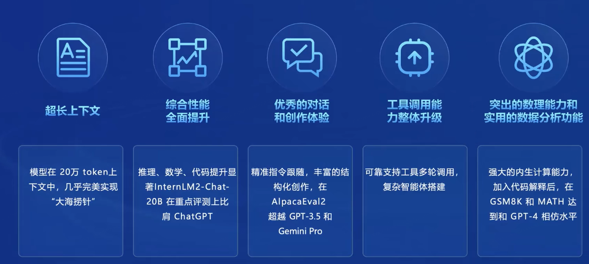

### 2.5 InternLM2 从模型到应用
#### 2.5.1 典型流程
- 业务场景是否复杂？->是否需要去微调模型？
- 算力够吗？->全参数微调还是部分参数微调？
- 是否需要环境交互？->是否需要智能体？
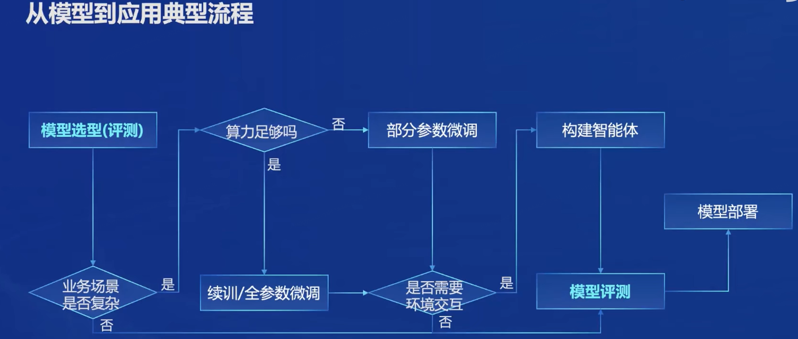

### 2.6 书生·浦语全链条开源开放体系
#### 2.6.1 数据-书生·万卷
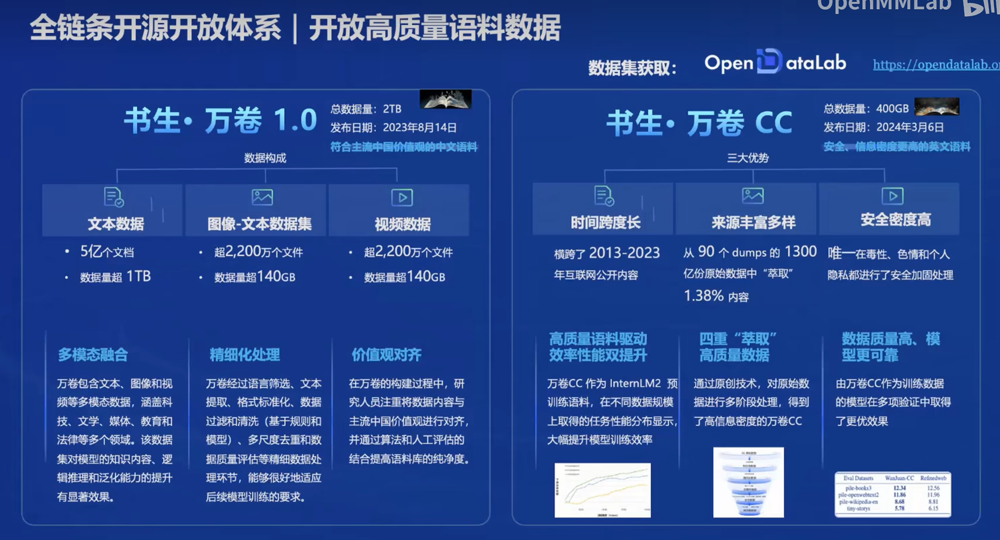
#### 2.6.2 预训练-InternLM-Train
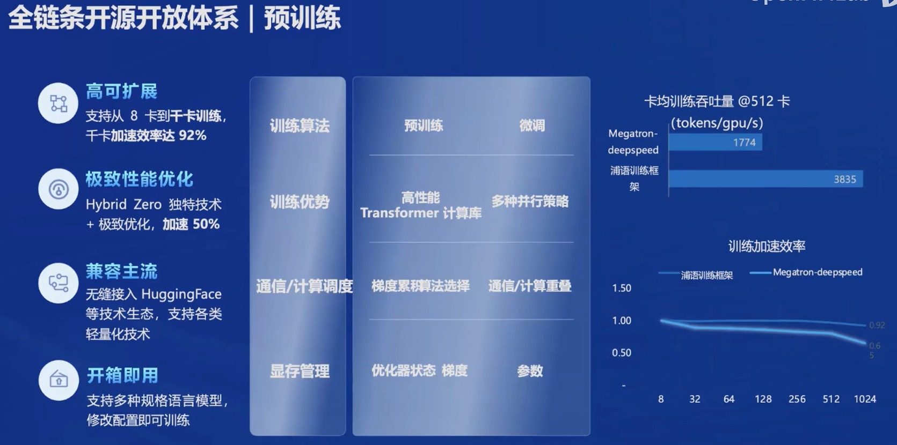
#### 2.6.3 微调-XTuner
- 增量续训：学习新知识，如某个垂类领域知识
- 有监督微调：让模型学会理解各种指令进行对话，或学习少量领域知识
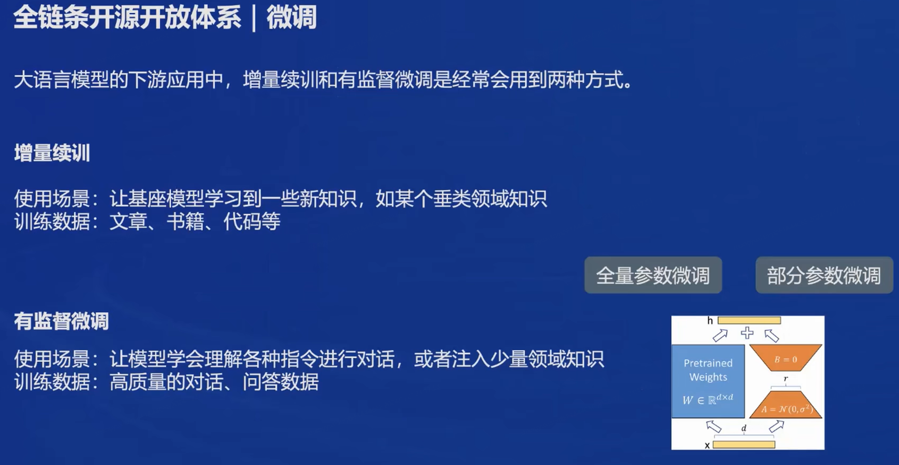
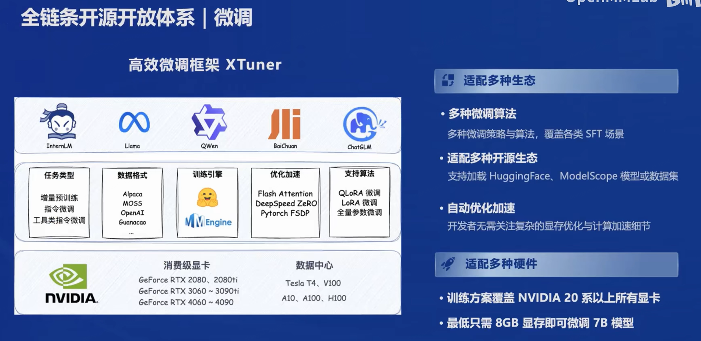
#### 2.6.4 部署_LMDeploy
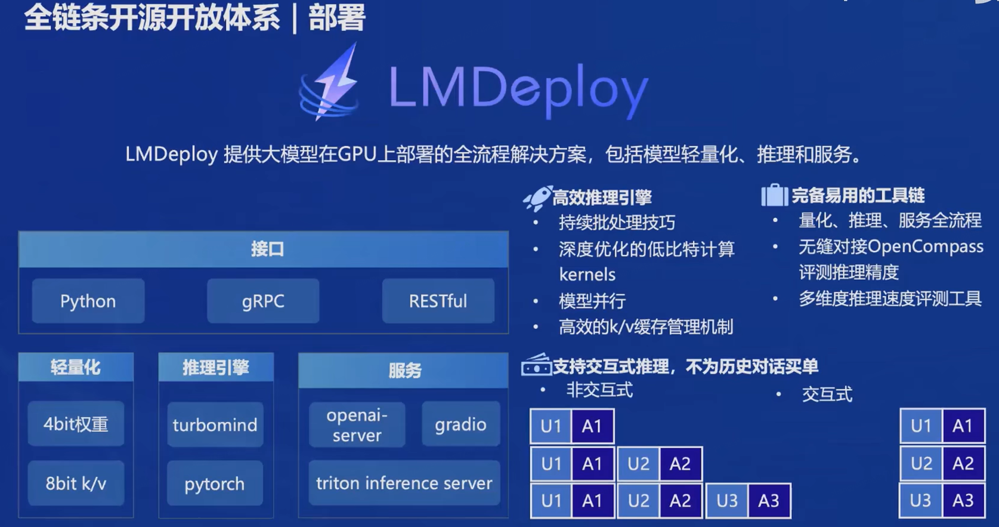
##### (a) LMDeploy vs. vLLM
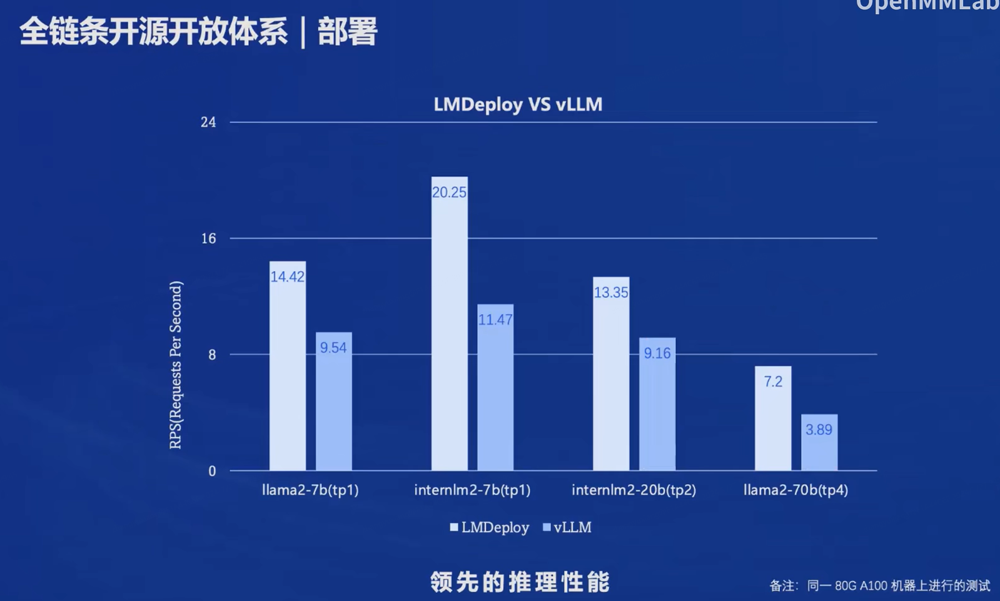
#### 2.6.5 评测-OpenCompass
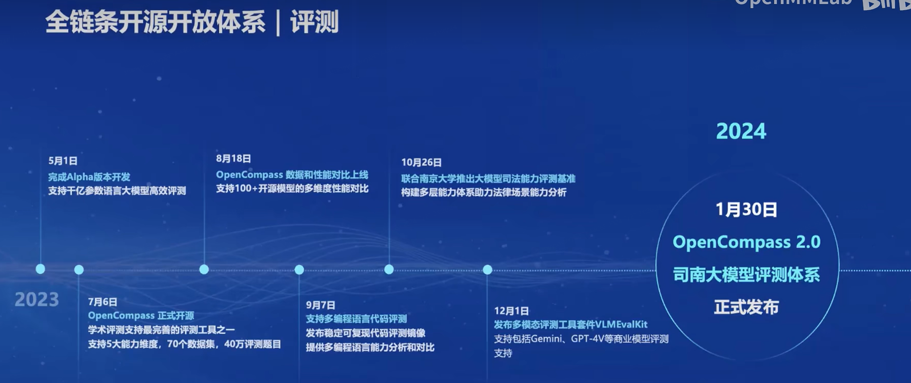
##### (a) CompassRank: 中立全面的性能榜单
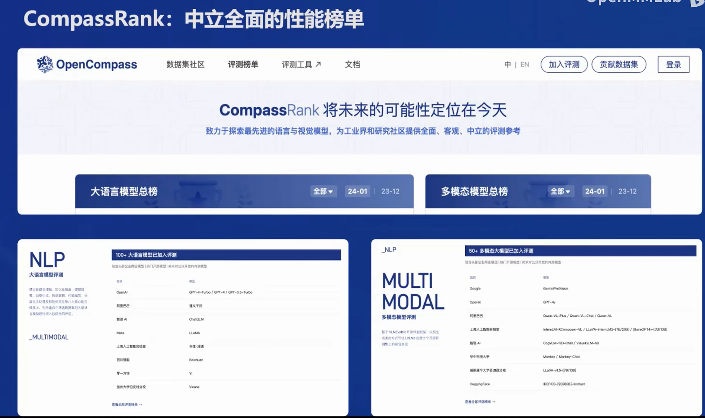
##### (b) CompassKit: 大模型评测全栈工具链
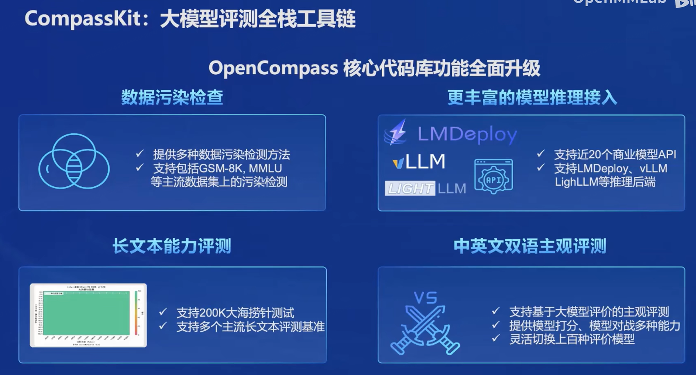
##### (c) CompassHub: 高质量评测基准社区
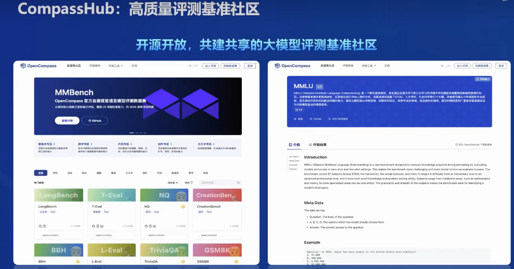
##### (d-1) CompassHub 年度榜单（综合性客观评测）
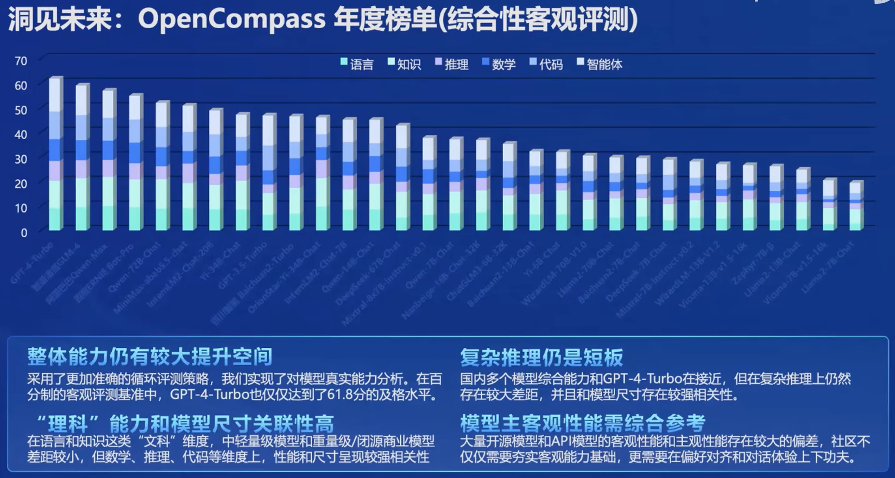
##### (d-2) CompassHub 年度榜单（主观评测-对战胜率）
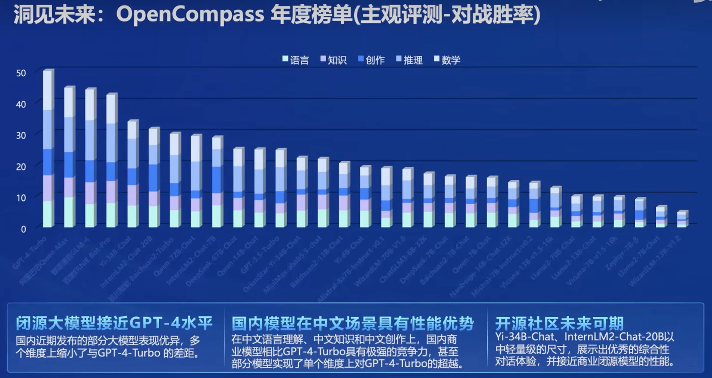
#### 2.6.6 应用-Lagent & AgentLego
##### (a) 轻量级智能体框架 Lagent
- 支持多种类型的智能体能力
- 灵活支持多种大模型
- 简单易拓展，支持丰富的工具
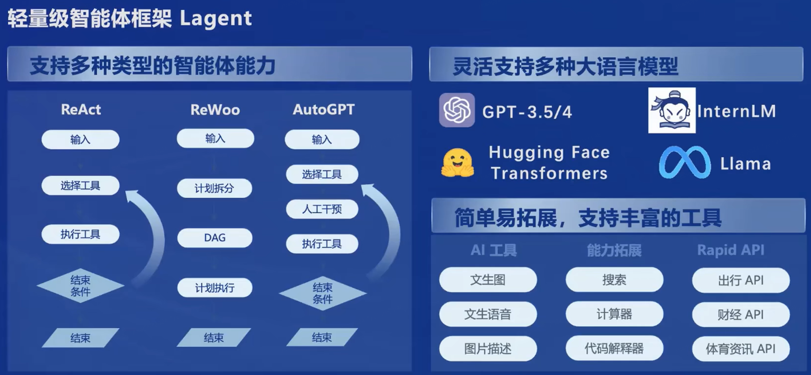
##### (b) 多模态智能体工具箱 AgentLego
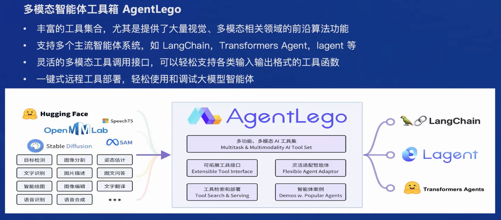